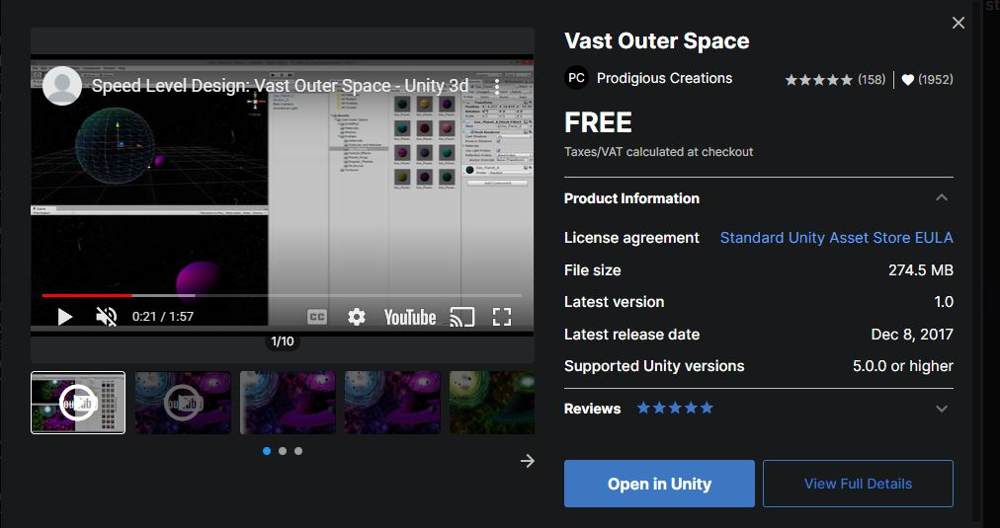

# GE2-SupplementalCA

Name: Ishaan Rawat

Student Number: C18459302

Class Group: DT228/TU856

## Description of the project:
The story consists of two planets, Blue and Red. A fleet of red ships are planning an attack on the space station outside the planet of the "blues". Two blue ships are patrolling the space station until the red ships arrive which leads to a short battle. Aware of the disadvantage due to the number of ships, the blue ships attempt to escape but fail as the red ship quickly intercept and destroy the blue ships. The space station is destroyed and the this is declared a victory for the Planet Red.

## Instructions for use
Simply press the **play button** in Unity.

## Events & How they work:
### Scene 1
- This scene is shot using Cinemachine (Freelook Camera)
- Three red ships consist of the BigBoid script which follow the path
- The Path script contains the path for the ships to travel
- The planet and asteroid are rotated using the RotateObject script
- The scene transitions to scene 2 using a collision (SceneSwitch1)
- There is an audiosource game object which controls the music throughout the scenes

### Scene 2
- This scene is shot using Cinemachine (Virtual Camera)
- It consists of two paths for the partrolling ships to travel in
- Once one of the ships collides with one of the waypoints, the scene transitions to scene 2
- This scene conveys the Blue Planet and the surrounding environment

### Scene 3
- This scene is shot using FollowCamera script
- A spawner gameobject consists of RedShipSpawner which spawns two 3 red ships getting closer to the blue planet
- Offset Pursue is used in this script to keep the ships in formation
- An asteroid spawner is also placed in the scene with the script AsteroidSpawner
- The asteroid's movements are caused by the AsteroidMovement script to keep the vibe "spacey"
- The scene is changed to the next one using the TimerSceneChange script

### Scene 4 ("Battle" between the Red and Blue ships)
**RedTeam**
- A parent RedShips gameobject consists of the RedShipBehaviour script in order to add the RedShipAttack script to all of its childs (Red ships)
- The RedShipAttack attaches the pursue script to all of the red ships
- If a ship is close to a blue ship then bullets are spawned and shot which decrement -5 health of the blue ships (bullet.cs)
- Bullet consist of red prefab and a shooting audio
- If the blue ships are destroyed, then the scene changes to the next scene

**BlueTeam**
- The blue ship consists of NoiseWander.cs and ShipMovement.cs
- ShipMovement.cs prevents the blue ships from travelling to0 far
- When the blue ship's health equal 0, they explode.

### Scene 5
- This scene consists of the arrive behaviour
- The red ships fly away from the space station
- The space Station blows up using a coroutine (SateliteExplosion.cs)
- The ships can be seen flying back into the asteroid field.]
- The scene is changed with TimeSceneChange1.cs

### Scene 6
- Scene consists of Canvas Text
- The End.

## Screenshots
### Scene 1: 

### Scene 2: 

### Scene 3: 

### Scene 4: 

### Scene 5: 

### Scene 6: 

## List of classes/assets in the project:

| Class/asset | Source |
|-----------|-----------|
| RedShipSpawner.cs | Self written |
| RedShipBehaviour.cs | Self written |
| RedShipAttack.cs | Self written |
| BlueShip.cs | Self written |
| AsteroidSpawner.cs | Self written |
| AsteroidMovement.cs | Self written |
| SceneSwitch1.cs | Self written |
| SceneSwitch2.cs | Self written |
| TimerSceneChange.cs | Self written |
| TimerSceneChange1.cs | Self written |
| FollowCamera | Self written |
| Audio.cs | Reference (https://www.youtube.com/watch?v=ha6U8jHl9ak&t=76s&ab_channel=BillyMan) |
| BigBoid | Reference (https://github.com/skooter500/GE2-2021-2022/tree/master/GE2%202022/Assets) |
| NoiseWander | Reference (https://github.com/skooter500/GE2-2021-2022/tree/master/GE2%202022/Assets) |
| Pursue | Reference (https://github.com/skooter500/GE2-2021-2022/tree/master/GE2%202022/Assets) |
| Arrive | Reference (https://github.com/skooter500/GE2-2021-2022/tree/master/GE2%202022/Assets) |
| Path | Reference (https://github.com/skooter500/GE2-2021-2022/tree/master/GE2%202022/Assets) |
| PathFollow | Reference (https://github.com/skooter500/GE2-2021-2022/tree/master/GE2%202022/Assets) |

## References
### Explosions
- https://assetstore.unity.com/packages/vfx/particles/fire-explosions/procedural-fire-141496

### Asteroids
- https://assetstore.unity.com/packages/3d/environments/asteroids-pack-84988

### Skybox 
- https://assetstore.unity.com/packages/2d/textures-materials/sky/starfield-skybox-92717

### Space Station
- https://assetstore.unity.com/packages/3d/vehicles/space/space-station-free-3d-asset-hdrp-urp-built-in-188734

### Vast Outer Space
- https://assetstore.unity.com/packages/3d/environments/sci-fi/vast-outer-space-38913

### Spaceships
- https://assetstore.unity.com/packages/3d/vehicles/space/star-sparrow-modular-spaceship-73167

## What I am most proud of in the assignment
I am proud of how the scenes are stitched together in the form of "mini-movie". The Cinemachine tool helped greatly with camera following and adding more engaging angles to the scenes. I am also proud of how the movements of the ships are all controlled by steering behaviours. I have learned a lot regarding steering behaviours over the course of this assignment.

## Youtube Video
**Demo**:

[

